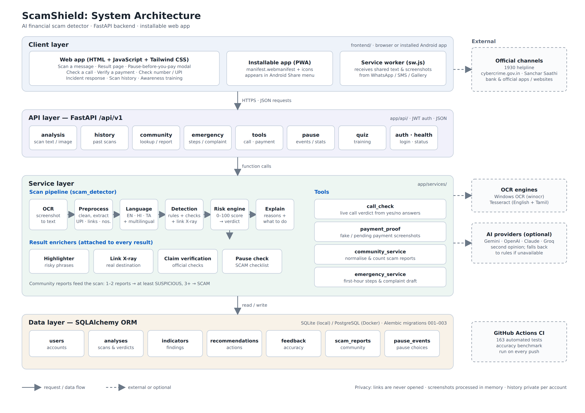

# 🛡️ ScamShield AI – AI Financial Scam Conversation Detector

[](https://fastapi.tiangolo.com)
[](https://www.python.org/)
[](https://www.postgresql.org/)
[](https://www.docker.com/)

ScamShield AI is an intelligent, defensive cybersecurity system designed to detect and prevent financial scams from suspicious SMS, WhatsApp messages, social media messages, emails, and screenshot uploads **before** a victim makes a payment or shares sensitive information.

---

## 📌 Problem Statement

Financial conversational scams such as fake KYC messages, UPI payment traps, fake lottery messages, electricity bill scams, part-time job scams, investment fraud, OTP theft, and impersonation attacks use urgency, fear, fake authority, and deceptive links to manipulate users into acting before verification.

ScamShield AI addresses this problem by analyzing suspicious content and providing an explainable risk assessment along with actionable safety recommendations.

---

## 💡 Proposed Solution

ScamShield AI combines:

- Text-based scam detection
- Screenshot OCR analysis
- Multilingual scam detection
- Rule-based detection
- AI-assisted analysis
- Risk scoring
- Link X-Ray analysis
- Claim verification
- Community scam reports
- Call scam assessment
- Payment screenshot verification
- Pause-before-payment intervention
- Emergency incident response

The system produces three primary verdicts:

**SAFE | SUSPICIOUS | SCAM**

---

# 🏗️ SYSTEM ARCHITECTURE



<sub>Diagram files: [PNG](docs/architecture.png) · [SVG](docs/architecture.svg) (editable). Regenerate the SVG with `python docs/diagram-src/build_architecture_svg.py`.</sub>

```text
                         SCAMSHIELD AI
                    SYSTEM ARCHITECTURE

┌───────────────────────────────────────────────────────────────┐
│                         CLIENT LAYER                          │
│                                                               │
│  Web App              Installable PWA       Service Worker    │
│  HTML + JS +          Android Share         Shared Text /     │
│  Tailwind CSS         Target                Screenshots       │
│                                                               │
│  Scan Message | Upload Screenshot | History | Quiz |          │
│  Check UPI | Incident Response | Awareness Training           │
└───────────────────────────────┬───────────────────────────────┘
                                │
                         HTTPS / JSON
                                ↓
┌───────────────────────────────────────────────────────────────┐
│                           API LAYER                           │
│                         FastAPI /api/v1                       │
│                                                               │
│  Analysis      History       Community       Emergency        │
│  Tools         Pause         Quiz            Auth / Health    │
└───────────────────────────────┬───────────────────────────────┘
                                │
                         Function Calls
                                ↓
┌───────────────────────────────────────────────────────────────┐
│                         SERVICE LAYER                         │
│                                                               │
│                       SCAN PIPELINE                           │
│                                                               │
│  OCR → Preprocess → Language → Detection → Risk → Explain     │
│                                                               │
│  Result Enrichers:                                            │
│  Highlighter | Link X-Ray | Claim Verification | Pause Check  │
│                                                               │
│  Tools:                                                       │
│  Call Check | Payment Proof | Community | Emergency           │
└───────────────────────────────┬───────────────────────────────┘
                                │
                           Read / Write
                                ↓
┌───────────────────────────────────────────────────────────────┐
│                          DATA LAYER                           │
│                        SQLAlchemy ORM                         │
│                                                               │
│ Users | Analyses | Indicators | Recommendations               │
│ Feedback | Scam Reports | Pause Events                        │
└───────────────────────────────────────────────────────────────┘

                         EXTERNAL SERVICES

        ┌──────────────────┬──────────────────┬─────────────────┐
        │                  │                  │                 │
        ↓                  ↓                  ↓                 ↓
 Official Channels     OCR Engines      AI Providers      GitHub Actions
 1930 / Official       Windows OCR      Gemini / OpenAI   CI / Testing
 Websites              Tesseract        Anthropic / Rules
```

---

## 🧰 TECHNOLOGY STACK

**Frontend**
- HTML
- JavaScript
- Tailwind CSS
- Progressive Web App (PWA)

**Backend**
- Python
- FastAPI

**OCR & Document Processing**
- Tesseract OCR
- Windows OCR
- Image preprocessing

**AI / ML**
- Rule-based scam detection
- Multilingual processing
- Optional AI / LLM providers
- Risk scoring engine
- Explainable analysis

**Database**
- SQLite
- PostgreSQL
- SQLAlchemy ORM

**Security**
- JWT authentication
- bcrypt password hashing
- Input validation
- PII-safe logging
- Per-user data isolation
- Safe HTML rendering

**Deployment**
- Docker
- Docker Compose
- GitHub Actions

---

## 🔄 END-TO-END WORKFLOW

```text
                         USER INPUT
                             │
                 ┌───────────┴───────────┐
                 ↓                       ↓
          TEXT MESSAGE              SCREENSHOT
                 │                       │
                 │                       ↓
                 │                      OCR
                 │                       │
                 └───────────┬───────────┘
                             ↓
                    TEXT PREPROCESSING
                             │
              ┌──────────────┼──────────────┐
              ↓              ↓              ↓
           URLs          Phone / UPI      Keywords
         Extraction       Extraction      & Entities
              │              │              │
              └──────────────┼──────────────┘
                             ↓
                     LANGUAGE DETECTION
                             │
                 English / Tamil / Hindi
                 Hinglish / Tanglish
                             ↓
                      SCAM DETECTION
                             │
             ┌───────────────┼───────────────┐
             ↓               ↓               ↓
         Rule Engine       AI Analysis      Severity
             │               │               │
             └───────────────┼───────────────┘
                             ↓
                        RISK ENGINE
                             │
                             ↓
                       RISK SCORE 0–100
                             │
                 ┌───────────┼───────────┐
                 ↓           ↓           ↓
               SAFE     SUSPICIOUS      SCAM
                 │           │           │
                 └───────────┼───────────┘
                             ↓
                     RESULT ENRICHMENT
                             │
             ┌───────────────┼──────────────┐
             ↓               ↓              ↓
        Highlighter      Link X-Ray    Claim Verification
                             │
                             ↓
                        PAUSE CHECK
                             │
                             ↓
                  SAFETY RECOMMENDATIONS
                             │
                             ↓
                       FINAL RESULT
```

---

## 📱 MESSAGE SCANNING WORKFLOW

```text
User
  ↓
Paste Suspicious Message
  ↓
POST /api/v1/analyze/message
  ↓
FastAPI API Layer
  ↓
Text Preprocessing
  ↓
Entity Extraction
  ├── URLs
  ├── Phone Numbers
  ├── UPI IDs
  ├── Payment Amounts
  └── Suspicious Keywords
  ↓
Language Detection
  ↓
Scam Detection
  ├── Fake KYC
  ├── Payment Request
  ├── Urgency
  ├── Impersonation
  ├── OTP Request
  └── Suspicious Links
  ↓
Risk Engine
  ↓
Result Enrichment
  ├── Red-Flag Highlighter
  ├── Link X-Ray
  ├── Claim Verification
  └── Pause Check
  ↓
Explanation Service
  ↓
Final Verdict
  ↓
SAFE / SUSPICIOUS / SCAM
```

---

## 📷 SCREENSHOT ANALYSIS WORKFLOW

```text
Screenshot Upload
        ↓
Image Validation
        ↓
OCR
        ↓
Text Extraction
        ↓
Preprocessing
        ↓
Language Detection
        ↓
Scam Detection
        ↓
Risk Scoring
        ↓
Explanation
        ↓
Final Verdict
```

---

## 🔍 LINK X-RAY WORKFLOW

ScamShield analyzes suspicious links without opening them.

```text
Suspicious URL
      ↓
URL Parser
      ↓
Domain Analysis
      ↓
Pattern Detection
      ↓
Risk Signal
      ↓
Risk Engine
```

The system checks for:

- `@` symbol tricks
- Look-alike domains
- Punycode
- Unicode look-alikes
- Brand impersonation
- URL shorteners
- Raw IP addresses
- HTTP URLs
- Suspicious domain endings
- Login/KYC bait
- Deceptive domain structures

Example:

```text
sbi.co.in@evil.xyz

Claimed Brand:
SBI

Actual Domain:
evil.xyz
```

---

## 🧠 RISK SCORING ENGINE

The Risk Engine combines multiple signals:

```text
                    RISK ENGINE
                         │
          ┌──────────────┼──────────────┐
          ↓              ↓              ↓
      Rule Score      AI Score      Severity Score
          │              │              │
          └──────────────┼──────────────┘
                         ↓
                  Evidence Boost
                         ↓
                   FINAL SCORE
                         ↓
              ┌──────────┼──────────┐
              ↓          ↓          ↓
            SAFE     SUSPICIOUS    SCAM
```

### Risk Formula

```text
Final Risk Score =
(Rule Score × 0.40)
+
(AI Score × 0.40)
+
(Severity Score × 0.20)
+
Evidence Boost
```

### Risk Levels

| Score | Verdict | Meaning |
|---|---|---|
| 0–29 | SAFE | No major suspicious indicators |
| 30–59 | SUSPICIOUS | Warning signs detected |
| 60–100 | SCAM | Strong signs of fraud or deception |

---

## ✋ PAUSE-BEFORE-PAYMENT WORKFLOW

```text
High-Risk / SCAM Result
          ↓
      Pause Screen
          ↓
    Safety Checklist
          ↓
  10-Second Cool-Off
          ↓
 ┌────────┼──────────────┐
 ↓        ↓              ↓
I Already Get Help     Continue
Paid                    Anyway
 ↓                         ↓
Incident              Checklist
Response              Completion
```

The checklist verifies:

- The sender was contacted independently
- The claim was checked through an official source
- No unexpected payment fee is being requested
- No OTP/PIN is being requested
- No remote-access application is being requested
- The user is not being threatened or rushed

---

## ☎️ CALL SCAM DETECTION WORKFLOW

```text
Suspicious Phone Call
        ↓
     Call Check
        ↓
    Questions
        ↓
  Analyze Answers
        ↓
 Risk Assessment
        ↓
     Verdict
        ↓
Safety Instructions
```

Important indicators:

- OTP request
- PIN request
- Remote-access request
- Money transfer request
- "Safe account" request
- Secrecy requirement

---

## 💳 PAYMENT SCREENSHOT VERIFICATION

```text
Payment Screenshot
        ↓
       OCR
        ↓
Extract Payment Details
        ↓
 ┌──────┼───────────────┐
 ↓      ↓               ↓
Amount Status        Reference
Check  Check           Check
 ↓      ↓               ↓
Mismatch Pending     Missing /
                    Invalid
        ↓
Payment Risk Analysis
        ↓
Verify Using Actual Bank App
```

The system does not consider a screenshot alone as proof of successful payment.

---

## 👥 COMMUNITY REPORT WORKFLOW

```text
Phone / UPI / Website / Email
              ↓
       Community Lookup
              ↓
       Existing Reports
              ↓
     ┌────────┴────────┐
     ↓                 ↓
  1–2 Reports       3+ Reports
     ↓                 ↓
At Least           SCAM Signal
SUSPICIOUS
     └────────┬────────┘
              ↓
         Risk Engine
```

Community reports are treated as unverified user reports.

---

## 🆘 INCIDENT RESPONSE WORKFLOW

```text
User Has Interacted With Scam
              ↓
       Incident Response
              ↓
       Identify Incident
              ↓
 ┌────────┬─────────┬──────────────┐
 ↓        ↓         ↓              ↓
 UPI     Card       OTP       Remote Access
              ↓
       Immediate Actions
              ↓
       Official Reporting
              ↓
        Follow-up Actions
```

Official reporting routes include:

- 1930
- cybercrime.gov.in
- Sanchar Saathi / Chakshu
- Bank's official support channels

---

## 🌐 MULTILINGUAL DETECTION

ScamShield supports scam-pattern recognition across:

- English
- Tamil
- Hindi
- Hinglish
- Tanglish

Example:

```text
உங்கள் வங்கி கணக்கு இன்று முடக்கப்படும்.
KYC update செய்ய உடனே ₹2000 அனுப்பவும்.
```

Detected indicators:

- Fake KYC
- Account-blocking threat
- Artificial urgency
- Payment request

---

## 🔐 SECURITY ARCHITECTURE

```text
                     SECURITY
                         │
          ┌──────────────┼──────────────┐
          ↓              ↓              ↓
         JWT           bcrypt       Validation
          │              │              │
          └──────────────┼──────────────┘
                         ↓
                  Access Control
                         ↓
                User Data Isolation
                         ↓
                  Safe Rendering
                         ↓
                  Privacy Controls
```

Security measures include:

- JWT authentication
- bcrypt password hashing
- Input validation
- HTML escaping
- PII-safe logging
- Per-user history isolation
- In-memory screenshot processing
- Non-transactional design
- Offline link analysis

---

## 🗄️ DATA FLOW

```text
CLIENT
   │
   ↓
FASTAPI
   │
   ↓
SERVICE LAYER
   │
   ├── OCR
   ├── Preprocessing
   ├── Language Detection
   ├── Scam Detection
   ├── Risk Engine
   ├── Explanation
   └── Recommendations
   │
   ↓
SQLALCHEMY ORM
   │
   ↓
DATABASE
   │
   ├── Users
   ├── Analyses
   ├── Indicators
   ├── Recommendations
   ├── Feedback
   ├── Scam Reports
   └── Pause Events
```

---

## 📁 PROJECT STRUCTURE

```text
AI-Financial-Scam-Conversation-Detector/
│
├── app/
│   ├── main.py
│   │
│   ├── api/
│   │   ├── auth.py
│   │   ├── analysis.py
│   │   ├── history.py
│   │   ├── community.py
│   │   ├── emergency.py
│   │   ├── tools.py              # call check, payment proof
│   │   ├── pause.py
│   │   ├── quiz.py
│   │   ├── health.py
│   │   └── deps.py
│   │
│   ├── core/
│   │   ├── config.py
│   │   ├── security.py
│   │   ├── logging.py
│   │   └── exceptions.py
│   │
│   ├── models/
│   │   ├── user.py
│   │   ├── analysis.py
│   │   ├── indicator.py
│   │   ├── recommendation.py
│   │   ├── feedback.py
│   │   ├── scam_report.py
│   │   └── pause_event.py
│   │
│   ├── schemas/
│   │   ├── auth.py
│   │   ├── analysis.py
│   │   ├── history.py
│   │   ├── feedback.py
│   │   └── common.py
│   │
│   ├── services/
│   │   ├── scam_detector.py      # scan pipeline orchestrator
│   │   ├── ocr_service.py
│   │   ├── text_preprocessor.py
│   │   ├── language_service.py
│   │   ├── multilingual.py
│   │   ├── llm_service.py        # rules + optional AI providers
│   │   ├── message_checks.py
│   │   ├── risk_engine.py
│   │   ├── explanation_service.py
│   │   ├── recommendation_service.py
│   │   ├── highlighter.py
│   │   ├── link_xray.py
│   │   ├── claim_verification.py
│   │   ├── pause_check.py
│   │   ├── call_check.py
│   │   ├── payment_proof.py
│   │   ├── community_service.py
│   │   └── emergency_service.py
│   │
│   ├── repositories/
│   │   ├── user_repository.py
│   │   ├── analysis_repository.py
│   │   └── feedback_repository.py
│   │
│   └── utils/
│       ├── constants.py
│       ├── quiz_bank.py
│       └── validators.py
│
├── frontend/
│   ├── index.html
│   ├── app.js
│   ├── tailwind.css
│   ├── tailwind.config.js
│   ├── manifest.webmanifest
│   └── sw.js
│
├── migrations/                   # Alembic migrations 001–003
├── docs/                         # architecture diagram (PNG / SVG)
├── tests/
├── benchmark/
├── Dockerfile
├── docker-compose.yml
├── requirements.txt
├── .env.example
└── README.md
```

---

## 🔌 API ARCHITECTURE

**Authentication**
```text
POST /api/v1/auth/register
POST /api/v1/auth/login
GET  /api/v1/auth/me
```

**Scam Analysis**
```text
POST /api/v1/analyze/message
POST /api/v1/analyze/image
GET  /api/v1/analyze/{analysis_id}
```

**History**
```text
GET    /api/v1/history
GET    /api/v1/history/{analysis_id}
DELETE /api/v1/history/{analysis_id}
DELETE /api/v1/history/clear
GET    /api/v1/history/stats
```

**Community**
```text
GET  /api/v1/community/lookup
POST /api/v1/community/reports
POST /api/v1/community/reports/from-analysis/{analysis_id}
```

**Call Check**
```text
GET  /api/v1/call-check/questions
POST /api/v1/call-check/assess
```

**Payment Verification**
```text
POST /api/v1/payment-proof/check
```

**Emergency**
```text
GET  /api/v1/emergency/guide
POST /api/v1/emergency/complaint-draft
```

**Quiz**
```text
GET  /api/v1/quiz/questions
POST /api/v1/quiz/answer
```

**Pause System**
```text
POST /api/v1/pause/events
GET  /api/v1/pause/stats
```

**Health**
```text
GET /health
GET /ping
GET /api/v1/health
```

---

## 🧪 TESTING WORKFLOW

```text
Developer Push
      ↓
GitHub Actions
      ↓
Automated Test Suite
      ↓
 ┌────┴────┐
 ↓         ↓
PASS      FAIL
 ↓         ↓
Build     Debug
Validated
```

Testing covers:

- Authentication
- Message analysis
- Screenshot analysis
- OCR
- Risk engine
- Language detection
- History
- Cross-user isolation
- Health checks
- Service layer
- Quiz behavior

### Measured Accuracy

`benchmark/` holds labelled messages and an evaluation script (`python -m benchmark.evaluate --show-errors`, or `--holdout` for the held-out set). A scam counts as caught when the verdict is SCAM or SUSPICIOUS; a genuine message is a false alarm when it isn't SAFE.

| Set | Messages | Scams caught | Genuine wrongly flagged |
|---|---|---|---|
| Tuning set, after tuning | 48 scams / 44 genuine | 100% | 0% |
| Held-out set (never used for tuning) | 16 scams / 14 genuine | 81% | 0% |

The held-out figure is the honest estimate. The messages were written to resemble real Indian scam and bank SMS; they were not collected from victims.

---

## 🚀 RUNNING LOCALLY

**Clone Repository**
```bash
git clone https://github.com/deborahtimothy2116-ops/AI-Financial-Scam-Conversation-Detector.git
cd AI-Financial-Scam-Conversation-Detector
```

**Create Virtual Environment**
```bash
python -m venv .venv
```

**Windows**
```powershell
.venv\Scripts\activate
```

**Install Dependencies**
```bash
pip install --upgrade pip setuptools wheel
pip install -r requirements.txt
```

**Configure Environment**
```text
.env.example → .env
```

**Run Tests**
```bash
python -m pytest
```

**Start Application**
```bash
uvicorn app.main:app --reload --port 8000
```

**Application URLs**
```text
Web Application:
http://localhost:8000

Swagger:
http://localhost:8000/docs

ReDoc:
http://localhost:8000/redoc
```

---

## 🐳 DOCKER DEPLOYMENT

```bash
docker compose up --build
```

Docker architecture:

```text
              Docker Compose
                    │
          ┌─────────┴─────────┐
          ↓                   ↓
      FastAPI              PostgreSQL
      Backend               Database
          │
          ↓
      OCR Services
```

---

## 🎯 HACKATHON DEMO WORKFLOW

```text
User Receives Suspicious Message
              ↓
        Opens ScamShield
              ↓
       Pastes / Shares Message
              ↓
          OCR if Image
              ↓
       Extract Indicators
              ↓
       Analyze Scam Patterns
              ↓
         Calculate Risk
              ↓
      SAFE / SUSPICIOUS / SCAM
              ↓
       Show Warning Signs
              ↓
          Link X-Ray
              ↓
       Claim Verification
              ↓
      Pause Before Payment
              ↓
     Safety Recommendations
              ↓
       Incident Response
```

---

## 🧪 DEMO SCENARIOS

**Demo 1 — Fake KYC**
```text
URGENT! Your bank account will be blocked today.
Send ₹2,000 to complete KYC immediately.
```
Expected: **SCAM** (risk level HIGH) · Phishing & KYC Expiry Trap

**Demo 2 — Lottery Scam**
```text
Congratulations! You have won ₹5,00,000.
Pay ₹2,000 processing fee to claim your prize.
```
Expected: **SCAM** (risk level HIGH) · Fake Lottery / Lucky Draw Scam

**Demo 3 — Investment Fraud**
```text
Guaranteed 30% profit every week.
Invest ₹10,000 now.
```
Expected: **SCAM** (risk level HIGH) · Crypto / High-Yield Investment Fraud

**Demo 4 — Genuine Message**
```text
Your friend sent the meeting notes.
See you tomorrow.
```
Expected: **SAFE**

**Demo 5 — Tamil Fake KYC**
```text
உங்கள் வங்கி கணக்கு இன்று முடக்கப்படும்.
KYC update செய்ய உடனே ₹2000 அனுப்பவும்.
```
Expected: **SCAM** (risk level HIGH) · Phishing & KYC Expiry Trap

---

## 🏁 CORE WORKFLOW

```text
              SCAMSHIELD AI

                  DETECT
                    ↓
                  EXPLAIN
                    ↓
                  VERIFY
                    ↓
                   PAUSE
                    ↓
                 PROTECT
```

ScamShield AI goes beyond simply classifying suspicious messages. It combines detection, explainability, verification, risk assessment, and preventive intervention to help users identify financial scams before they result in financial loss or exposure of sensitive information.

---

## 📄 LICENSE

This project is released under the MIT License.
